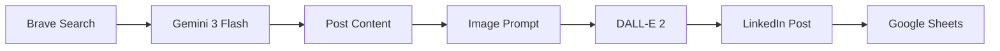

# LinkedIn Content Automation - Kestra Workflow

🤖 Automated LinkedIn content generation and publishing system powered by AI. Creates engaging posts about AI, Automation, and Low-Code topics with custom images.

## 🌟 Features

- **AI-Powered Content**: Uses LangChain with Google Gemini 3 Flash for intelligent content creation
- **Web Research**: Leverages Brave Search API to find trending topics  
- **Visual Content**: Generates custom images using OpenAI DALL-E 2
- **Auto Publishing**: Posts directly to LinkedIn via API
- **Theme Tracking**: Uses Google Sheets to avoid topic repetition
- **Scheduled Execution**: Runs twice daily on weekdays (9 AM & 4 PM, Brazil time)

## 📁 Project Structure

```
.
├── linkedin-content-generator.yml    # Kestra workflow definition
├── requirements.txt                   # Python dependencies
├── scripts/
│   ├── linkedin_agent.py             # Main AI agent for content creation
│   ├── sheets_manager.py             # Google Sheets integration
│   ├── openai_image_generator.py     # DALL-E 2 image generation
│   └── linkedin_publisher.py         # LinkedIn API publishing
├── CREDENTIALS_SETUP.md               # Detailed credential setup guide
├── QUICKSTART.md                      # Quick reference guide
└── README.md                          # This file
```

## 🚀 Quick Start

**See [QUICKSTART.md](QUICKSTART.md) for a fast setup guide!**

For detailed credential configuration, see [CREDENTIALS_SETUP.md](CREDENTIALS_SETUP.md).

## 🔧 Prerequisites

- Kestra instance running
- GitHub repository for storing scripts
- **Google Gemini API key** (for content generation)
- **OpenAI API key** (for image generation)
- **Brave Search API key** (for research)
- **LinkedIn OAuth2 credentials** (for publishing)
- **Google Sheets API credentials** (Service Account)

## 📝 Setup Overview

### 1. Fork & Clone Repository

```bash
git clone https://github.com/YOUR_USERNAME/linkedin-content-generator.git
cd linkedin-content-generator
```

### 2. Configure Kestra KV Store

Store all sensitive credentials securely in Kestra's Key-Value Store:

```bash
# AI & Search APIs
kestra kv set GOOGLE_API_KEY "your-google-gemini-api-key"
kestra kv set OPENAI_API_KEY "your-openai-api-key"
kestra kv set BRAVE_SEARCH "your-brave-search-api-key"

# LinkedIn Access
kestra kv set LINKEDIN_ACCESS_TOKEN "your-linkedin-oauth-token"

# Google Sheets (paste entire service account JSON)
kestra kv set GOOGLE_SHEETS_CREDENTIALS '{...service account JSON...}'

# Spreadsheet ID (from Google Sheets URL)
kestra kv set LINKEDIN_CONTENT_SPREADSHEETS "your-spreadsheet-id"
```

### 3. Configure LinkedIn Person URN

Update `PERSON_URN` in `scripts/linkedin_publisher.py` with your LinkedIn Person URN.

See [CREDENTIALS_SETUP.md](CREDENTIALS_SETUP.md) for how to obtain this.

### 4. Deploy to Kestra

```bash
kestra flow validate linkedin-content-generator.yml
kestra flow namespace update company.team linkedin-content-generator.yml
```

## 🎯 Workflow Steps

1. **Clone Repository** - Pulls latest scripts from GitHub
2. **Setup Environment** - Installs Python dependencies  
3. **Generate Content** - AI researches trends and creates post
4. **Generate Image** - DALL-E 2 creates visual content
5. **Publish to LinkedIn** - Posts content with image
6. **Update Tracking** - Saves theme to Google Sheets

## ⚙️ How It Works

### Content Generation Flow



1. **Research**: Brave Search finds trending topics
2. **Content**: Gemini creates engaging LinkedIn post
3. **Image**: DALL-E 2 generates relevant visual
4. **Publish**: LinkedIn API publishes the post
5. **Track**: Google Sheets logs the topic

## 📅 Schedule

**Default Schedule** (Monday-Friday only):
- 🌅 **9:00 AM** (Brazil/São Paulo time)
- 🌆 **4:00 PM** (Brazil/São Paulo time)

Change schedule by editing `cron` expressions in `linkedin-content-generator.yml`.

## 🔍 Optimization Highlights

Compared to the original N8N workflow:

✅ **60% fewer API calls** - Consolidated AI agents  
✅ **Version controlled** - Scripts stored in GitHub  
✅ **Graceful failures** - Continues without image if needed  
✅ **Modern stack** - LangChain 1.0 + latest AI models  
✅ **Cost efficient** - DALL-E 2 for images

## 🛠️ Troubleshooting

### Image Generation Fails
- Verify `OPENAI_API_KEY` is valid
- Check API quota limits at platform.openai.com
- Workflow continues with text-only post

### LinkedIn Publishing Fails  
- Verify access token hasn't expired
- Check Person URN is correct
- Review LinkedIn API quota

### Google Sheets Not Updating
- Verify service account has Editor permissions
- Check spreadsheet ID is correct
- Ensure credentials JSON is valid

## 📊 Monitoring

View execution logs in Kestra UI:
- **Execution History**: Track success rate
- **Output Files**: Review generated content
- **Error Logs**: Debug failures

## 🎨 Customization

### Change Content Style

Edit `scripts/linkedin_agent.py` system prompt to modify:
- Writing tone (formal vs. casual)
- Post length
- Topic focus
- Language

### Change AI Models

```python
# In linkedin_agent.py
model_name = "gemini-3-flash-preview"  # or gemini-pro

# In openai_image_generator.py  
model = "dall-e-2"  # or dall-e-3 (more expensive)
```

### Change Schedule

Edit `linkedin-content-generator.yml`:
```yaml
triggers:
  - id: morning_post
    cron: "0 9 * * 1-5"  # Mon-Fri at 9 AM
```

## 📄 License

MIT License - Use and modify freely!

## 🤝 Contributing

Contributions welcome! Please:
1. Fork the repository
2. Create a feature branch
3. Submit a pull request

---

**Made with ❤️ using Kestra, LangChain, Gemini, and DALL-E**
